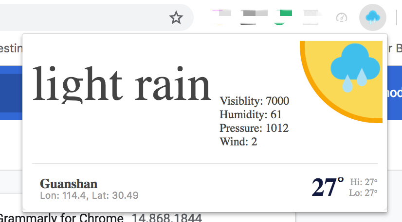
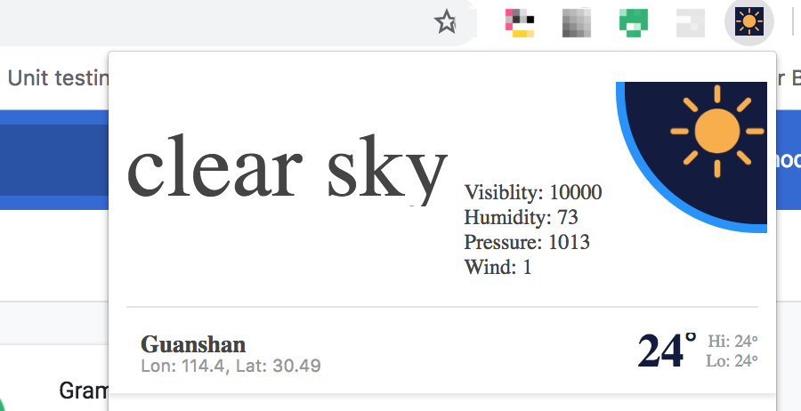

# Weather Now Chrome Extension

## Overlook
This is an extension to show real-time weather as the icon in the menubar and click to display detailed info popup.

Real-time Icon in menubar: 

Popup: daytime: 

Popup: nighttime: 

### Installation for development
download source code
go to the root folder and run

```
 npm install
```

after finish, run

```
 npm run build
```

Everytime when modify code, need to 
```
 npm run build
```
and refresh in the chrome extension page to see the changes.

### Put it in developer mode in chrome for development

Go to more tools -> extensions, check developer mode, choose 'Load unpacked', and go to the root folder, where the manifest.json locate, select.

## License

[Read the LICENSE file for more information](LICENSE)
